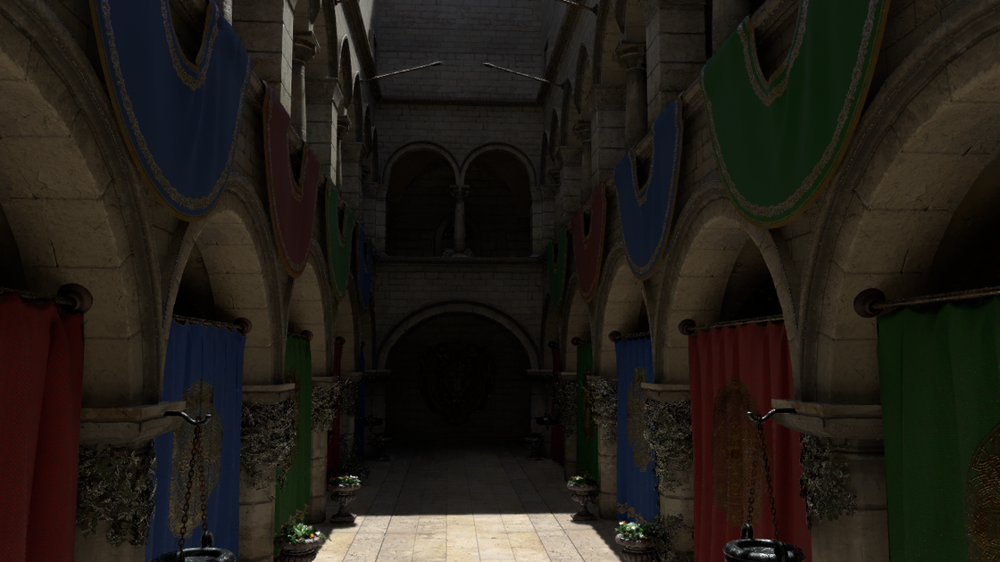
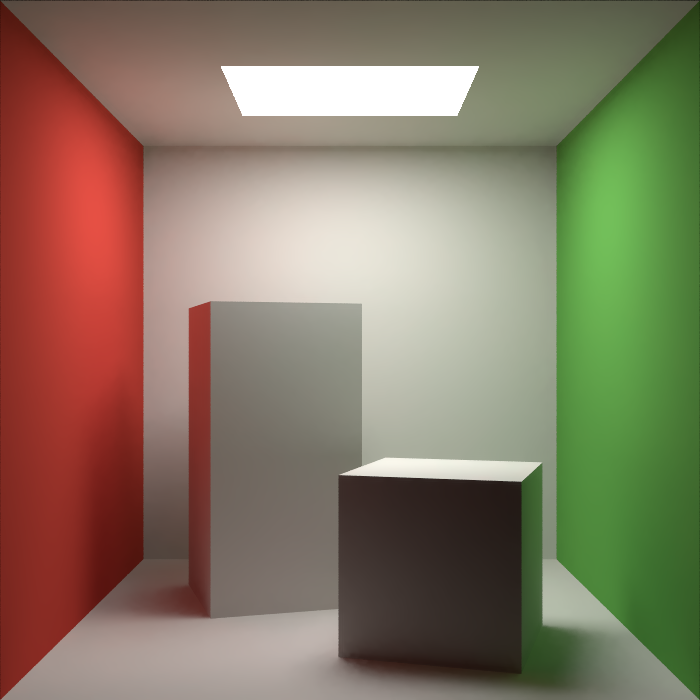
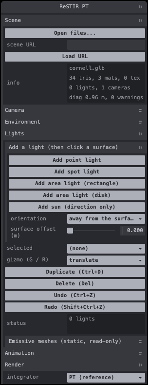

# ReSTIR PT in WebGPU

A browser path tracer that implements **ReSTIR PT** (GRIS, Lin et al. 2022) with the algorithmic changes of
**ReSTIR PT Enhanced** (Lin, Kettunen and Wyman 2026), written in TypeScript and WGSL on WebGPU. A statistical
harness checks it against its own reference path tracer and against **Blender 5.2.2 Cycles**.



| | |
|---|---|
|  |  |

The images are ReSTIR-interactive at the app defaults (Mode B lights, temporal and spatial reuse, denoiser on), after
64 frames at 720p internal resolution, captured by `validation/harness/ui-shots.ts` (Sponza downscaled to 1120 px). Sponza is lit by a Poly Haven sky HDRI and a sun; the
Cornell box by a camera-visible rectangle light under the ceiling.

## What it is

- **Reference path tracer (PT).** Progressive, one sample per pixel per frame. Next-event estimation with MIS, and
  Russian roulette. BVH traversal runs in compute shaders: WebGPU has no hardware ray tracing.
- **ReSTIR PT.**
  - Streaming RIS over a unified path tree.
  - The hybrid shift: reconnection where the reconnection predicate allows it, random replay otherwise.
  - Defensive pairwise MIS.
  - **Temporal reuse** against the exact previous-frame camera and light state, so lights and the camera can move.
  - **Spatial reuse**: paired passes on reciprocal pairing maps.
  - Presets: interactive, unbiased, 2022 criteria, offline, initial candidates only.
- **Enhanced features.** Four of them can be toggled under ReSTIR › Enhanced features:
  - σ 16 Gaussian pairing maps;
  - RIS-NEE light tiles;
  - dual motion vectors;
  - the duplication map with an adaptive confidence cap. This one is biased; it is off by default, so
    ReSTIR-interactive is unbiased out of the box (it can be switched on for less temporal noise).

  Russian roulette at initial sampling is also part of the Enhanced set. ReSTIR-interactive applies it after bounce 2
  (ReSTIR › Enhanced features › RR after bounce).
- **Light modes.**
  - **B** (default): area lights are hit by BSDF rays and combined with NEE by MIS.
  - **A**: analytic lights are reached by NEE only, so smooth mirrors and glass never show them and there are no
    area-light caustics.
  - **A′**: lights are hittable only after a delta lobe.
- **Lights.** Point and spot (radius 0), rectangle and disk area lights (with spread), sun (angle 0), and emissive
  triangles. All analytic lights can be placed, edited and keyframed in the app.
- **Environment.** One equirectangular HDRI (`.hdr` / `.exr`), importance-sampled, with rotation, strength, tint and
  camera visibility. It matches Cycles world lighting.
- **Materials.**
  - glTF metallic-roughness mapped to Cycles' Principled BSDF (GGX).
  - GGX glass and transmission.
  - glTF material extensions `KHR_materials_transmission`, `_ior`, `_specular` and `_emissive_strength`; other
    extensions are ignored with a warning.
  - Alpha MASK.
  - Normal maps with Cycles' node math and MikkTSpace tangents.
  - Smooth shading (also inside ReSTIR).
- **Denoiser.** A-SVGF-lite: demodulation, moments, à-trous filtering, and α from the ReSTIR temporal gradient, plus a
  temporal resolve. It is on by default in ReSTIR-interactive and unavailable in ReSTIR-unbiased.
- **Loaders.**
  - glTF / GLB through glTF-Transform in a Worker, with Draco and meshopt and `KHR_lights_punctual`.
  - USD (`.usd`, `.usda`, `.usdc`, `.usdz`) through LightUSD in a Worker, including PointInstancer and UsdUVTexture.
- **Debug tooling.**
  - About 130 debug views across the G-buffer, BVH, environment sampling, shading normals, every ReSTIR stage
    (reservoir, temporal, shifts, MIS, pairing) and the denoiser.
  - Stage taps and a pixel probe.
  - A ReSTIR pixel inspector with a 3D path overlay.
  - A HUD with per-pass GPU times and NaN/Inf and overflow counters.
  - A Cycles compare view (split, flip, relative error, t-map). In dev builds the app can also export the scene and
    render the reference with headless Blender.

## Quick start

Requirements:
- **Chrome with WebGPU.** Development and all gates use Chrome 154 on Apple Silicon (Metal backend); no flags are
  needed.
- A recent **Node.js** with npm.

Other browsers and GPUs are untested.

```sh
npm install
npm run dev          # Vite dev server, http://localhost:5173 (the next free port if taken)
```

The app opens `validation/assets/cornell/cornell.glb`. This Cornell box has **no lights of its own**: add one under
Lights › "Add area light (rectangle)", then click the ceiling, or load an HDRI. The integrator starts as the
reference PT; switch Render › integrator to **ReSTIR PT**.

**Live demo (GitHub Pages):** <https://vork.github.io/RestirPT-WebGPU/>. It needs a browser with WebGPU (Chrome or Edge 113+, Safari 26+).
Sponza with the sky HDRI: <https://vork.github.io/RestirPT-WebGPU/?scene=validation/assets/downloaded/sponza/Sponza.gltf&env=validation/assets/downloaded/hdri/kloofendal_48d_partly_cloudy_puresky_1k.hdr>.
The site is built by `.github/workflows/pages.yml` on every push to `main` (Sponza and the HDRI are fetched in CI and copied by `scripts/pages-assets.mjs`).

URL parameters:

| Parameter | Effect |
|---|---|
| `?scene=<url>` | Load a scene instead of the Cornell box, e.g. `?scene=/validation/assets/downloaded/sponza/Sponza.gltf` |
| `?env=<url>` | Load an HDRI, e.g. `?env=/validation/assets/downloaded/hdri/kloofendal_48d_partly_cloudy_puresky_1k.hdr` |
| `?res=540p\|720p\|1080p\|native` | Internal resolution (default 540p) |
| `?seed=N` | Fixed run seed |
| `?hud=0` | Start with the HUD hidden |
| `?pattern=1` | Analytic test pattern only (no renderer) |

The dev server serves the repository root, so anything under `validation/assets/` can be loaded by URL. Sponza and
the HDRIs are not in git. To fetch them (into the gitignored `validation/assets/downloaded/`):

```sh
python3 validation/blender/fetch_sponza.py     # Khronos glTF-Sample-Assets Sponza, ~53 MB
npx tsx validation/assets/fetch_hdris.ts       # Poly Haven 1k HDRIs, hashes pinned in validation/assets/hdris.json
```

Other scripts:

| Script | What it runs |
|---|---|
| `npm run build` | Typecheck, then production build |
| `npm run typecheck` | `tsc --noEmit` |
| `npm test` | CPU lane and the dawn.node GPU pre-check |
| `npm run test:chrome` | GPU suites in headless Chrome, the authoritative lane |

## Loading scenes

Any of these works:
- **Drag and drop** files onto the page.
- **Scene › Open files...** (a file picker that allows several files).
- **Scene › scene URL** followed by Load URL.
- The `?scene=` / `?env=` parameters.

Accepted formats:
- Scenes: `.glb`, `.gltf`, `.usd`, `.usda`, `.usdc`, `.usdz`.
- Environments: `.hdr`, `.exr`.

A `.gltf` must be dropped or picked together with its `.bin` and texture files; they are resolved by name. Load
warnings (for example an ignored material extension, or alpha BLEND rendered as MASK) stay listed in the loading
overlay. Environments can also be loaded from the Environment folder.

## Controls

| Input | Action |
|---|---|
| Right mouse drag | Look around |
| `F` | Toggle fly mode (pointer lock) |
| `W` `A` `S` `D` | Move |
| `E` / `Q` | Up / down (world Y) |
| Mouse wheel | Fly speed (×1.25 per notch). Hold `Shift` for ×4, `Ctrl` for ×0.25 |
| `Home` | Reset the view |
| `Ctrl+1..9` / `1..9` | Save / recall a camera bookmark |
| Left click | Select a light, drag a gizmo handle, or place a light |
| `G` / `R` | Translate / rotate gizmo (with a light selected) |
| `Del` / `Backspace` | Delete the selected light |
| `Ctrl+D` | Duplicate the selected light |
| `Ctrl+Z`, `Shift+Ctrl+Z` or `Ctrl+Y` | Undo, redo |
| `Esc` | Cancel placement or drag, or deselect |
| `Space` | Play / pause the animation |
| `P` / `.` | Pause / step one frame |
| `Shift+R` | Reset history, including the ReSTIR temporal history |
| `Alt+click` | Probe a pixel (probe panel, ReSTIR inspector) |
| `H` | Show / hide the HUD |

Keys use physical key positions (`KeyboardEvent.code`), independent of the keyboard layout. The Help folder in the
panel lists the same bindings.

## Lights and animation

**Lights folder.**
1. Pick "Add point / spot / area light (rectangle) / area light (disk)", then click a surface. The light is placed
   through the V-buffer, oriented away from the surface (or toward the camera) and offset slightly.
2. "Add sun" needs no click: it appears in front of the camera, and you aim it with the rotate gizmo.
3. Select a light by clicking it or from the list. Its properties use Blender units:
   - power in W, or W/m² for the sun;
   - colour and exposure (EV);
   - spot size and blend;
   - area size and spread;
   - visible to camera.
4. Changing the type replaces the light. Emissive meshes are listed read-only.

**Animation folder and timeline bar** (bottom of the page):
- Keyframe the selected light, the camera, or the environment (rotation, strength), with linear or step
  interpolation, or turn on auto-key.
- Presets: orbit around the scene centre, bob, and a spot sweep.
- Time runs on the wall clock (interactive) or on frame / fps (validation).
- Save / load: the editor state as `scene.json`, and a `frames[]` JSON export.

Light edits and playback restart only the progressive accumulation. The ReSTIR temporal history survives them: each
edit is refreshed in the kernel.

## Potato ReSTIR

The app starts in **interactive ReSTIR**. For speed, choose **ReSTIR → preset → Potato ReSTIR**.
It caps max bounces at 1 (two scattering vertices), uses one spatial partner and four RIS light candidates,
and disables reservoir history. Temporal denoising stays on, with three à-trous passes. Render resolution,
geometry, materials, and primary visibility are unchanged. Expect darker indirect light, reduced multi-bounce
reflections/transmission, and more noise during motion. Returning to interactive restores its normal defaults;
explicit feature and denoiser overrides remain session-wide. Performance and research: [perf2 §9](docs/decisions/perf2-plan.md#9-potato-restir).

## The panel

Top-level folders, in order. Expert sub-folders start collapsed.

| Folder | Contents |
|---|---|
| **Scene** | Open files, scene URL, scene info (triangles, materials, lights, cameras, warnings) |
| **Camera** | Vertical FOV, fly speed, mouse sensitivity, invert Y, reset view. *File cameras and bookmarks*; *Camera track* (record, play, export / import JSON) |
| **Environment** | Load an HDRI (file or URL), strength, rotation Z, tint, visible to camera. *Sampling*: env NEE (≡ Cycles world sampling AUTOMATIC / NONE), importance-map resolution |
| **Lights** | Add / place, selection, gizmo mode, duplicate / delete / undo / redo, the selected light's properties, emissive meshes |
| **Animation** | Play, time mode, fps, duration, loop. *Keys*, *Presets*, *Save / load* |
| **Render** | Integrator (PT / ReSTIR PT / albedo), light mode, max bounces, Russian roulette, accumulate, pause / step / restart accumulation. *Output*: internal resolution, exposure, view transform (Standard is Blender-exact), upscale filter, HUD. *Sampling*: pixel jitter (i.i.d. by default), freeze seed / frame. *Advanced*: texture path (interactive mips / validation exact texels), watertight intersection, colour format, NaN/Inf highlight, overlay |
| **ReSTIR** | Preset, temporal reuse, freeze / reset temporal history. *Enhanced features*: pairing maps, RIS-NEE, dual motion vectors, duplication map (off by default), RR after bounce. Arena status (replay fraction, queues, shift outcomes, error counters), pixel inspector |
| **Denoiser** | On / off, à-trous iterations, α min, σ luminance, σ albedo, temporal resolve, reset. *Temporal gradient*: λ₀, λ₁, gradient on camera motion. Status with GPU time |
| **Debug views** | Category, then view, with a legend (id, kind, writing pass, colour key for code views), and the stage tap. *View mapping*: range, log, colormap, absolute value, split with the beauty image. *Pixel probe* |
| **Validation** | *Compare with Cycles*: view mode, exposure, relative-error and t-map settings, batch capture, load reference EXRs. Dev only: *Cycles reference render* (export, render headless in Blender, auto-load) and *Export scene package* |
| **Help** | Keys and mouse |

The HUD (top left) shows:
- fps, and per-pass GPU times when the `timestamp-query` feature is available;
- NaN/Inf, BVH-overflow, queue and probe counters;
- camera state;
- integrator, light, ReSTIR and denoiser status lines.

## Validation

Correctness comes first. Every milestone ends with a gate: `npm run validate -- --milestone Mx`.

**Gates.**
- **Gate 0**: unit, property and GPU tests. For example, shift round trips must have zero logic failures over ≥ 10⁷
  trials per case.
- **Gate 1**: harness calibration. A/A tests and planted biases on real Cycles data.
- **Gate 2 / Stage A**: our PT ≡ Cycles.
- **Gate 3 / Stage B**: our ReSTIR ≡ our PT. This runs as a ladder of rungs (3.1–3.11), from initial candidates
  through spatial, temporal, dynamic, Enhanced, glass, alpha, smooth-shading and Mode-B scenes. The ladder stops at
  the first failing rung.
- **Gate 5**: bias budget of the one biased option, the duplication map (off by default in the app). Its limit is
  Enhanced's 3.25 %.

**Equivalence testing.** Equivalence is tested, not just "no significant difference": TOST with α = 0.01 per side.
The margins δ:

| Comparison | Global | Per tile |
|---|---|---|
| PT vs Cycles | 0.5 % | 2 % |
| ReSTIR vs PT | 0.2 % | 1 % |
| Dynamic sequences | 0.2 % | 64² tiles 2 %, mask regions 3 % |

Further tests and rules:
- Welch t, χ²_red, KS/AD, Šidák-corrected tiles and BH-FDR complement TOST.
- Unit sizes come from pilot runs.
- A failed unit is re-run once on disjoint seeds.
- δ is never loosened silently.
- Analytic closed forms (furnaces, slabs, analytic quadrature of the environment) are checked on both renderers.

**Planted biases.** Each gate also has to *detect* deliberate δ-scale errors in ≥ 9 of 10 repeats, while the A/A
control passes. Examples:
- light power ×1.0075, spot blend 0.16, emission ×1.01 (Stage A);
- W ×1.003, an omitted or marginal-pdf shift Jacobian, temporal and Enhanced-feature plants with predicted signs
  (Stage B).

This shows that the tests have the power to catch errors of the size the margins allow.

**Cycles references.**
- Rendered headless by Blender 5.2.2. Other versions are rejected (`validation/blender/cycles_settings.py`).
- Scenes travel as versioned scene packages (`docs/decisions/scene-bridge.md`).
- Known model differences are documented as deviations D1–D11 (`docs/decisions/cycles-deviations.md`).

**Running a gate.**

```sh
# Python 3.13 analysis env (validation/requirements.txt)
~/.local/bin/uv venv --python 3.13 validation/.venv
~/.local/bin/uv pip install --python validation/.venv/bin/python -r validation/requirements.txt

# Blender 5.2.2; the defaults are the macOS app paths
export BLENDER=/Applications/Blender.app/Contents/MacOS/Blender
export BLENDER_PY=/Applications/Blender.app/Contents/Resources/5.2/python/bin/python3.13

npm run validate -- --milestone M4                      # M0 M1 M2 M3a M3b M3c M4 M5 M5.5 M6 M7
npm run validate -- --milestone M6 --part r311          # one part (M5: core|static; M6: core|r37|r39|r310|r311|gate5|plants;
                                                        #           M7: core|loader|stageA|e2e|r38|plants)
npm run validate -- --milestone M4 --only <pkg>,<pkg>   # a scene subset
```

Run times:
- Full gates take hours: M4 took 44 882 s; M5 is planned at over 14 h, in two parts.
- Cycles references and PT references are cached.
- GPU jobs serialise on a lock directory (`/tmp/restirpt-gpu.lock`): Blender and Chrome never share the GPU.
- Results land in `validation/out/` (gitignored).

**App smokes.** These drive the real app in headless Chrome, for example
`npx tsx validation/harness/m7-app-smoke.ts`. They exist for M1, M3b, M3c, M4, M5, M5.5, M6 and M7.

## Status

Facts from `docs/decisions/validation.md`, `docs/decisions/blender-5.2-migration.md` and the milestone commits.

| Milestone | Scope | Result |
|---|---|---|
| M0 | Bootstrap, Blender and Chrome harness, LightUSD spike | Done; LightUSD rc4: GO with conditions (`docs/decisions/usd.md`) |
| M1 | glTF loader, SAH BVH2, HDRI display, fly camera, debug framework | Done; Sponza + HDRI app smoke, primary pass 1.8 ms at 540p |
| M2 | Validation harness, Gate 1-lite on Cycles data | 24/24 (re-run on Blender 5.2.2: 24/24) |
| M3a | Reference PT, lights, editor, animation, Stage A | 175/175: PT ≡ Cycles on 25 scenes + 7 keyframe sequences |
| M3b | Glass, Mode B in the PT | 96/96: 21 Stage-A units, five glass plants detected 10/10 |
| M3c | HDRI environment lighting | 173/173 (Blender 5.2.2 re-run) |
| M4 | ReSTIR PT core (spatial, unbiased) | 220/221; the app-smoke failure was fixed and passes 31/31 on re-run. 63/63 ladder units, \|Δ_Y\| ≤ 0.0048 % |
| M5 | Temporal reuse and dynamics | Static rungs 77/77, rung 3.6 18/18; 18 of 19 gating plants as predicted (one detect-only, four deferred to M6) |
| M5.5 | A-SVGF-lite denoiser | 43/43 |
| M6 | Enhanced features, Mode-B ReSTIR, glass and alpha in ReSTIR | Rungs 3.7 112/112, 3.9 108/108, 3.10 13/13, 3.11 73/73; Gate 5 6/6; plants 23/23; interactive default is now Mode B |
| M7 | Normal maps, smooth shading in ReSTIR, USD completion, loader fidelity, end-to-end stock imports | Loader 6/6, E2E 21/21, rung 3.8 10/10; M4/M5 regression suites not re-run on M7 (see validation.md) |
| M8 | Performance: compact layout, CWBVH, f16 path state, dynamic resolution | In progress |

## Known limitations

- **No hardware ray tracing.** WebGPU in Chrome on Metal exposes no ray queries, so traversal is a compute-shader BVH.
  M8 works on performance; the plan's targets are ≤ 35 ms at 540p.
- **Static geometry.** Only lights, the camera and the environment move.
- **Lights.** Point and spot lights have radius 0 and the sun has angle 0. There are no IES profiles, no light tree,
  and no USD dome, cylinder or geometry lights.
- **Environment.** One equirect HDRI: no procedural or sky worlds, and no portals.
- **Materials.** No volumes, coat, sheen, subsurface, anisotropy or thin film. Alpha BLEND is rendered as MASK 0.5.
  KTX2/Basis textures are ignored. Only `TEXCOORD_0` is used.
- **Mode A** is not equivalent to B behind smooth mirrors and glass. It exists for validation; Mode B is the default.
- **Platform.**
  - Limited to 10 storage buffers per stage.
  - Metal compiles WGSL with relaxed math (FMA contraction; NaN/Inf checks are bit tests).
  - Documented Metal quirks (`docs/decisions/platform-lanes.md`, Q1–Q4): a per-thread state-size miscompile cliff; no
    `timestampWrites` on the interactive ReSTIR passes; lower-precision hardware filtering of `rgb9e5` /
    `rgba16float`; and f16 stores that round toward zero.
- Tested only on Chrome 154 / Apple Silicon. Other GPUs and browsers may work but are not validated.

## Documentation map

| Path | Contents |
|---|---|
| `docs/PLAN.md` | Implementation plan: scope, architecture, correctness rules, pass graph, milestones M0–M8, verification |
| `docs/math.md` | Normative formula reference; the WGSL cites its anchors |
| `docs/decisions/validation.md` | Validation scenes, sizing, coverage and gate results M3a–M7 |
| `docs/decisions/restir-api.md`, `restir-temporal-api.md`, `restir-m6-api.md`, `m7-api.md` | API contracts of M4, M5, M6 and M7 |
| `docs/decisions/bsdf-api.md`, `denoiser.md`, `data-formats.md` | BSDF / material API, denoiser design and gate, GPU data formats |
| `docs/decisions/scene-bridge.md`, `usd.md` | Scene package format, LightUSD decision |
| `docs/decisions/cycles-deviations.md`, `blender-5.2-migration.md` | Deviations from Cycles (D1–D11), Blender 5.1.2 → 5.2.2 audit |
| `docs/decisions/platform-lanes.md` | Chrome vs dawn.node lanes, Metal quirks Q1–Q4 |
| `docs/research/` | Research reports and their adversarial verifications: GRIS math, the Enhanced paper, Cycles conventions, validation methodology, WebGPU platform, reference code, ReSTIR in practice, gap specs (BSDF lobes, glass, HDRI, lights, reconnection predicate, temporal moving lights, pass cost), M8 research, the plan review |
| `docs/papers/` | Text extracts of the GRIS and Enhanced papers (PDFs are gitignored) |

## Project layout

```
src/
  core/
    gpu/        device and limits, WGSL composer, readback
    bvh/        binned-SAH BVH2 builder (Worker), layout, CPU trace
    io/         EXR, PFM, PNG, zlib
    scene/      glTF loader (Worker), flatten, tangents, light store, animation, scene packages;
                env/ (HDR/EXR decode, importance tables), usd/ (LightUSD adapter, Worker)
    render/     renderer, PT kernel, lights / env / textures on the GPU, debug views, timestamps;
                restir/ (kernel, stages, pairing, ensembles), denoise/, luts/ (Cycles LUTs)
    shaders/    WGSL: bvh, common, debug, geom, lights, material, passes, path, post, restir, scene
  app/          app shell (main, app, integration, loader, fly camera), editor/ (light editor, gizmos, picking,
                undo), timeline/, compare/ (Cycles compare view), ui/ (Tweakpane panel, HUD, inspector)
validation/
  harness/      validate.ts, gate-m3a … gate-m7, app smokes, batch / chain runners, GPU lock
  gpu-tests/    GPU suites (*.gpu.test.ts) for the Chrome and dawn.node lanes
  blender/      Cycles settings, scene building, reference rendering, asset fetching
  tools/        statistics and comparison (compare.py, stats.py, analytic checks, reports)
  scenes/       committed scene packages and their generators
  assets/       Cornell box, USD test files, HDRI pins (downloads are gitignored)
tests/          CPU unit tests (vitest)
docs/           plan, math, decisions, research
```

## References

- Daqi Lin, Markus Kettunen, Benedikt Bitterli, Jacopo Pantaleoni, Cem Yuksel, Chris Wyman. *Generalized Resampled
  Importance Sampling: Foundations of ReSTIR.* ACM Transactions on Graphics 41(4), Article 75 (SIGGRAPH 2022).
- Daqi Lin, Markus Kettunen, Chris Wyman. *ReSTIR PT Enhanced: Algorithmic Advances for Faster and More Robust
  ReSTIR Path Tracing.* Proc. ACM Comput. Graph. Interact. Tech. 9(1), Article 13 (2026). doi:10.1145/3804494.
- Benedikt Bitterli, Chris Wyman, Matt Pharr, Peter Shirley, Aaron Lefohn, Wojciech Jarosz. *Spatiotemporal
  reservoir resampling for real-time ray tracing with dynamic direct lighting.* ACM Transactions on Graphics 39(4)
  (SIGGRAPH 2020).
- Christoph Schied et al. *Spatiotemporal variance-guided filtering: real-time reconstruction for path-traced global
  illumination.* High Performance Graphics 2017. Also A-SVGF: Schied, Peters, Dachsbacher, PACM CGIT 2018.
- Zheng Zeng, Shiqiu Liu, Jinglei Yang, Lu Wang, Ling-Qi Yan. *Temporally Reliable Motion Vectors for Real-time Ray
  Tracing.* Computer Graphics Forum 40 (2021).
- Sven Woop, Carsten Benthin, Ingo Wald. *Watertight ray/triangle intersection.* JCGT 2(1) (2013).
- Reference implementation: [DQLin/ReSTIR_PT](https://github.com/DQLin/ReSTIR_PT) (Falcor).

## Acknowledgements

- [Blender](https://www.blender.org/) Cycles is the ground truth of the validation.
- [glTF-Transform](https://gltf-transform.dev/), [LightUSD](https://www.npmjs.com/package/lightusd),
  [Tweakpane](https://tweakpane.github.io/docs/), [three.js](https://threejs.org/) (EXR loader) and
  [mikktspace](https://www.npmjs.com/package/mikktspace).
- Sponza: Crytek, via the Khronos glTF-Sample-Assets (CC BY 3.0).
- HDRIs: [Poly Haven](https://polyhaven.com/) (CC0).
- The statistical tooling uses NumPy, SciPy, OpenImageIO and NVIDIA's FLIP.
